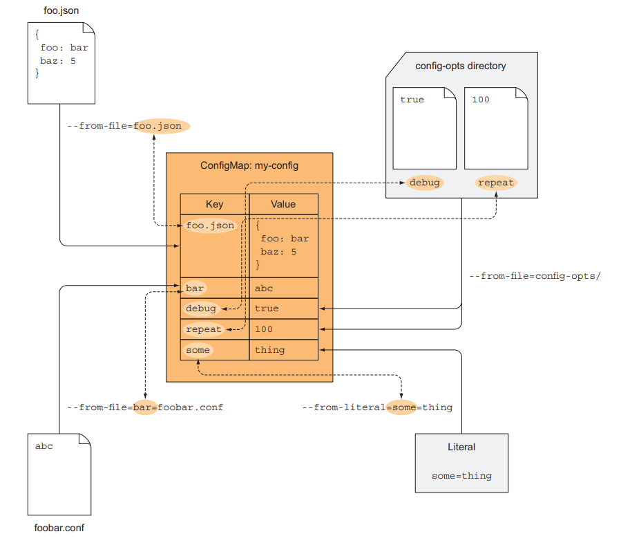
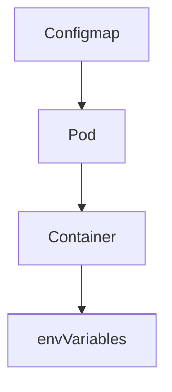

# Configmap
A ConfigMap is an API object used to store non-confidential data in key-value pairs. Pods can consume ConfigMaps as environment variables, command-line arguments, or as configuration files in a volume.

## USING THE KUBECTL CREATE CONFIGMAP COMMAND
- Configs can be created in kubernetes in multiple ways
    
    1. Using individual files
    2. Using  directory  and 
    3. Using literal value

** What  happens when pod try to refernce a nonexistent config map **

Kubernetes schedules the pod normally and tries to run its containers.
The container referencing the non-existing ConfigMap will fail to start.

* However , One can mark ConfigMap as optional (by setting configMapKeyRef.optional: true) *

###  Important
 in each container, Kubernetes also automatically
exposes environment variables for each service in the same namespace. These
environment variables are basically auto-injected configuration.